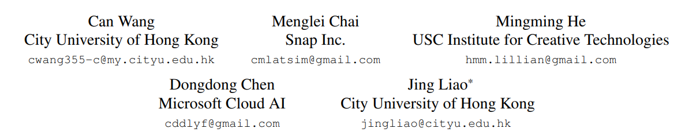

# CLIP-NeRF:
## Text-and-Image Driven Manipulation of Neural Radiance Fields
### 

---
# target
- 对于NeRF的condition-driven manipulation，主要是改变shape和appearance
- 

---
# Method 
$$
    F: (\mathbf{x,v}) \rightarrow (\mathbf{c},\sigma) \\
    F_\theta: (\mathbf{x,v,z_{s},z_{a}}) \rightarrow (\mathbf{c},\sigma) \\
    (\Gamma(\mathbf{x})\oplus z_s,\Gamma(\mathbf{v})\oplus z_a) \rightarrow (\mathbf{c},\sigma)

$$
---
## 问题
- 形状和颜色相互联系，另外一个会随着其中一个改变
- 想要解耦appearance 和 shape

---
## Solution
### Shape Deformation Network $\tau$
$$
\tau: (\mathbf{x},z_{s}) \rightarrow \Delta \mathbf{x} \\
\Gamma ^{\ast}(\mathbf{p},z_{s})=\{\gamma ^ {\ast} (p,\Delta p) | p \in \mathbf{p}, \Delta p \in  \tau(\mathbf{p},z_{s})\} \\
\gamma^{\ast} (p,\Delta p )_{k} = \gamma(p)_{k}
 + tanh(\Delta p_{k})$$

<!-- _footer: inspired by Nerfies-->
---
### Deferred Appearance Conditioning
$$
\mathcal{F}_{\theta}(\mathbf{x},\mathbf{v},z_s,z_a): (\Gamma ^{\ast}(\mathbf{x},z_{s}),\Gamma(\mathbf{v})\oplus z_a) \rightarrow (\mathbf{x},\sigma) \\
\mathcal{F}_{\theta}(\mathbf{v},z_s,z_a) ,x \in R
$$
---
### CLIP-Driven Manipulation
initial state: $z'_{s},z'_{a}$
trained Mapper: $\mathcal{M}_{s},\mathcal{M}_{a}$
$$
z_s = \mathcal{M}_{s}(\hat{\xi}_{t}(\mathbf{t})) + z'_{s}, \\
z_a = \mathcal{M}_{a}(\hat{\xi}_{t}(\mathbf{t})) + z'_{a},
$$